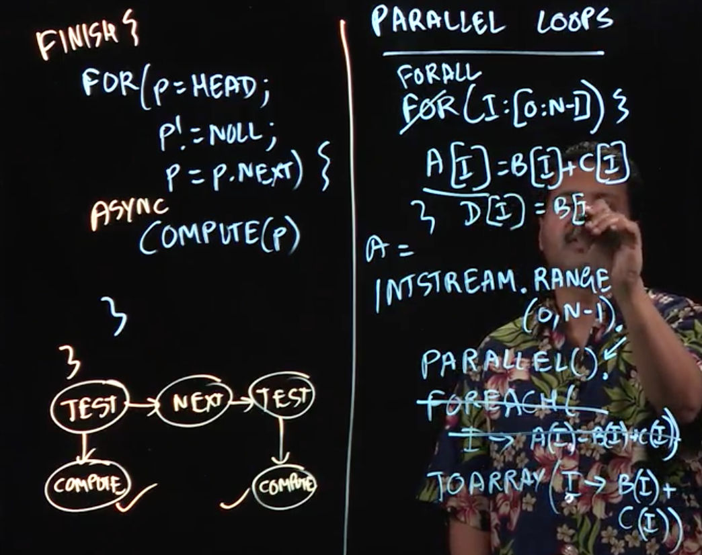

# Lecture 3 - Loop Parallelism



Next up, we'll be looking at parallel loops. We know that loops take a large portion of the execution time in many programs. They come in a variety of forms. These include:

## Pointer Chasing For Loops
Along the lines of `for (p = HEAD; p!= null; p = p.next) compute(p);`

To parallelize this example, we simply need to wrap the whole loop in a `finish` statement, and the compute step in an async, along the lines of:
  
```
Finish {
  for (p = HEAD; p!= null; p = p.next) {
    async {
      compute(p);
    }
  }
}
```
  
A look at the computation graph for this algorithm confirms that we can parallelize the compute step.

## Counter For Loops

These are your standard for loops that count through, for instance, an array. E.g. `for (int p = 0; p < array.length; p++)`.

While similar to the previous pointer chasing loop, there is one bog difference; we know the number of iterations we'll do before we begin the loop. This can be very useful for efficient parallelism.

In fact, many programming models use the term `forall` to mean "execute all the iterations in parallel". Logically, you can think of this as creating a seperate task for each iteration, and doing a finish when the for-all is done.

In this way, you can take pretty much any loop you like an convert it into a parallel loop, providing its legal to do so (i.e. all the iterations are independent of each other).

### Java Streams

It turns out that with Java, it's possible to do some of this more elegantly using streams. For instance, to do matrix multiplication, you can do this by doing something along the lines of what's shown in the slide. All you have to do is:

```Java
IntStream.range(0, N-1)
  .parallel()
  //.foreach(i -> a[i] = b[i] + c[i]) would work but isn't the most elegant solution
  .toArray(i -> b[i] + c[i]) //and set a = result;
```

Now, of course there are situations where you want to do more than 1 thing in the loop. In this case, a forall loop is actually what you need. We'll explore them, and the algorithms they let us construct, further in this module.

## Lecture Notes

Lecture Summary: In this lecture, we learned different ways of expressing parallel loops. The most general way is to think of each iteration of a parallel loop as an async task, with a finish construct encompassing all iterations. This approach can support general cases such as parallelization of the following pointer-chasing while loop (in pseudocode):

```
finish {
for (p = head; p != null ; p = p.next) async compute(p);
}
```

However, further efficiencies can be gained by paying attention to counted-for loops for which the number of iterations is known on entry to the loop (before the loop executes its first iteration). We then learned the forall notation for expressing parallel counted-for loops, such as in the following vector addition statement (in pseudocode):

```
forall (i : [0:n-1]) a[i] = b[i] + c[i]
```

We also discussed the fact that Java streams can be an elegant way of specifying parallel loop computations that produce a single output array, e.g., by rewriting the vector addition statement as follows:

```Java
a = IntStream.rangeClosed(0, N-1).parallel().toArray(i -> b[i] + c[i]);
```

In summary, streams are a convenient notation for parallel loops with at most one output array, but the forall notation is more convenient for loops that create/update multiple output arrays, as is the case in many scientific computations. For generality, we will use the forall notation for parallel loops in the remainder of this module.

Optional Reading:

1. [Tutorial on Executing Streams in Parallel](https://docs.oracle.com/javase/tutorial/collections/streams/parallelism.html#executing_streams_in_parallel)