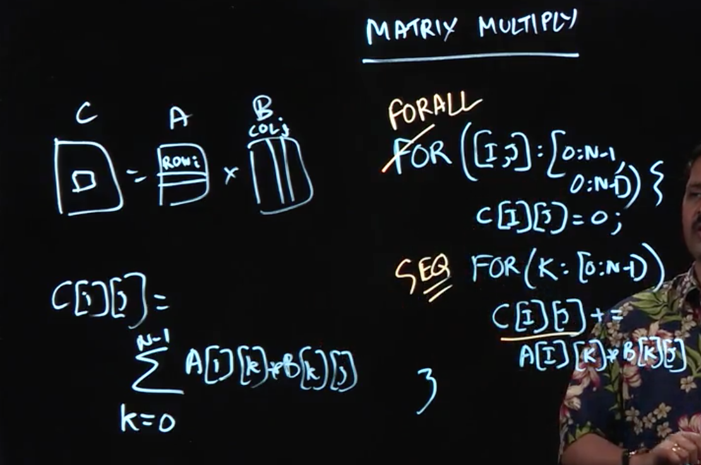

# Lecture 3.1 - Parallel Matrix Multiplication



Now that we've learned about parallel loops and the for-all construct, let's see how we can apply this knowledge to matrix multiplication. Note that here, we'll be using the algorithm for "dense" matrix multiplication. In other, words we won't be looking at any of the potential optimizations of matrix multiplication that exist for sparse matrices.

We won't explain how matrix multiplication works here in this note. Consult the lecture image above for a simple recap.

Interestingly, this algorithm is often used to measure the speed of the fastest computers in the world.

## Sequential Algorithm

What does the algorithm for matrix multiplication look like? Well, in Java the simplest way to do it would be using nested for loops (note that we assume that the matrices A and B are square matrices of dimensions NxN):

```Java
for (int i = 0; i < N; i++) {
  for (int j = 0; j < N; j++) {
    for (int k = 0; k < N; k++) {
      c[i][j] += a[i][k] + b[k][j];
    }
  }
}
```

## Parallelizing the Algorithm

The first thing to note is that we can neatly replace the n-squared iterations (over `i` and `j`) with a `forall` loop.

What about the k-loop? Can we run it in parallel?

Well, there is an issue here, namely that if we run the `k` loop in parallel, each iteration will be reading and writing from/to the same `c[i][j]`. This would lead to a data race, so we need to keep the k-loop sequential.

Thus we can see how we go from a sequential algorithm to a parallel algorithm with parallelization of order n-squared.

## Lecture Notes

In this lecture, we reminded ourselves of the formula for multiplying two n × n matrices, a and b, to obtain a product matrix, c, of size n × n:

c[i][j] = \sum_{k=0}^{n-1} ∑ a[i][k] ∗ b[k][j]

This formula can be easily translated to a simple sequential algorithm for matrix multiplication as follows (with pseudocode for counted-for loops):

```
for(i : [0:n-1]) {
  for(j : [0:n-1]) { c[i][j] = 0;
    for(k : [0:n-1]) {
      c[i][j] = c[i][j] + a[i][k]*b[k][j]
    }
  }
}
```

The interesting question now is: which of the for-i, for-j and for-k loops can be converted to forall loops, i.e., can be executed in parallel? Upon a close inspection, we can see that it is safe to convert for-i and for-j into forall loops, but for-k must remain a sequential loop to avoid data races. There are some trickier ways to also exploit parallelism in the for-k loop, but they rely on the observation that summation is algebraically associative even though it is computationally non-associative.