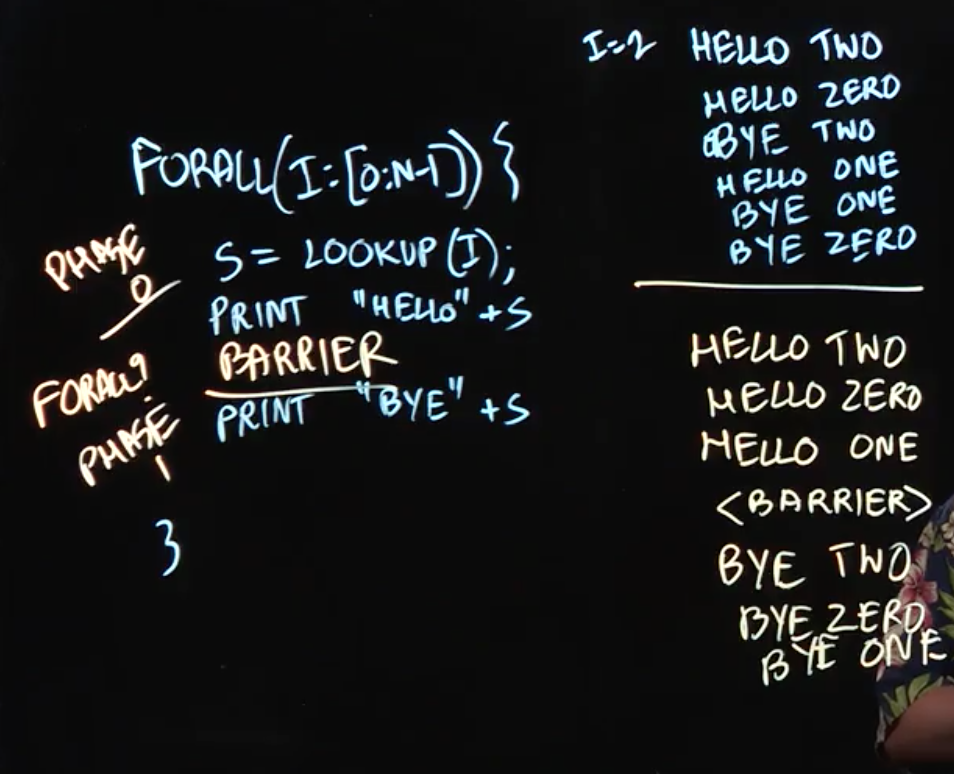

# Lecture 3.2 - Barriers in Parallel Loops



Let's take a slightly deeper look at for forall loops work, using the following example (in pseudocode):

```
forall(i: [0 : N-1]) {
  s = lookup(i);
  print "Hello" + s;
  print "bye" + s;
}
```

What this would program's output look like?

The first thing to note is that the program would be non-deterministic; we'd get a different output with each execution, as the statements will print in different orders.

## Introducing Barriers

What if we then want to add a constraint, say that all the hellos are printed first? Well, one simple way would be to add a second forall loop to handle printing the bye statements. The problem with this approach would be that you'd either need to find a way to communicate the value of `s` to the second forall loop, or you'd need to perform the lookup again, which is suboptimal.

A more elegant way to solve this problem is to add the concept of a "barrier", which requires prevents us from progressing through the loop until all iterations have completed the preceding steps (here, the "Hello" step.)

This allows us to add the concept of "phases" to our forall loops.

## Lecture Notes

Lecture Summary: In this lecture, we learned the barrier construct through a simple example that began with the following forall parallel loop (in pseudocode):

```
forall (i : [0:n-1]) {
        myId = lookup(i); // convert int to a string 
        print HELLO, myId;
        print BYE, myId;
}
```

We discussed the fact that the HELLO’s and BYE’s from different forall iterations may be interleaved in the printed output, e.g., some HELLO’s may follow some BYE’s. Then, we showed how inserting a barrier between the two print statements could ensure that all HELLO’s would be printed before any BYE’s.

Thus, barriers extend a parallel loop by dividing its execution into a sequence of phases. While it may be possible to write a separate forall loop for each phase, it is both more convenient and more efficient to instead insert barriers in a single forall loop, e.g., we would need to create an intermediate data structure to communicate the myId values from one forall to another forall if we split the above forall into two (using the notation next) loops. Barriers are a fundamental construct for parallel loops that are used in a majority of real-world parallel applications.

