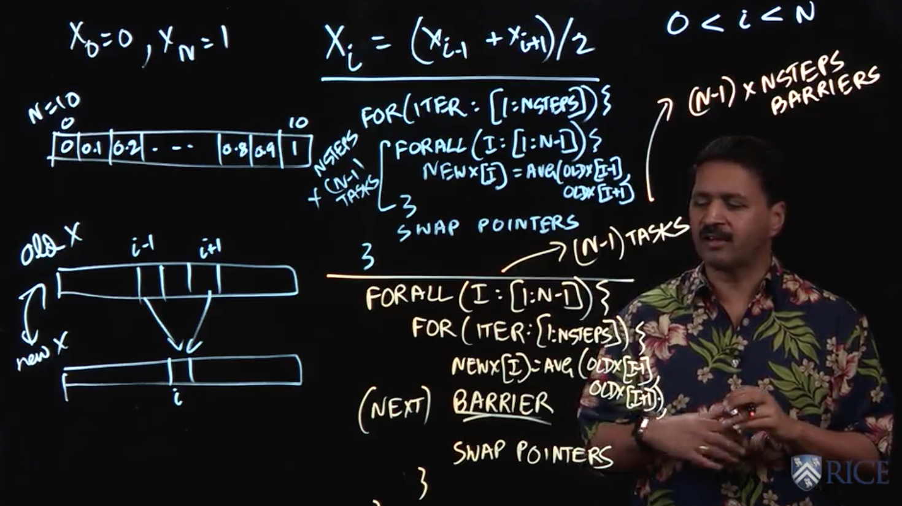

# Lecture 3.3 - Parallel One-Dimensional Iterative Averaging



We'll now look at another example application, one-dimensional iterative averaging.

## The Problem

The problem is as follows:

> Let say we have a collection of numbers x_{i} that satisfy the following equation:
> 
> ```
> x_{i} = (x_{i-1} + x_{i+1}) / 2
> ```
>
> In other words, each element is the average of its two neighbouring elements. We also introduce some simple constraints, namely:
> ```
> x_{0} = 0
> x_{N} = 1
> 0 < i < N
> ```

Note that there is are much more complex versions of this problem (e.g. 2, 3, X dimensional) that build on the same concepts.

Inspecting the problem, we might immediately note some simple solutions. For example, in the case N = 10, we would just have:
```
x_{0} = 0, x_{1} = 0.1, x_{2} = 0.2, ..., x_{8} = 0.8, x_{9} = 0.9, x_{10} = 1
```

However, our goal is instead to ask ourselves how we would make a computer go about solving this problem?

## Jacobi Relaxation

The classical solution is to have two arrays, x_old and x_new, and at each step the items in x_new by averaging the neighbouring items in x_old (Note that this step can be parallelized). Once you've done this for each element, swap the array pointers (x_old -> x_new and vice versa) and repeat the process until the answer has stabalised.

We need procedures like this because in the real-world, there well might not be an analytical solution.

What does this look like in (pseudo)code? Well:

```
for(iter: [1:NSteps]) {
  forall(i:[i:N-1]) {
    x_new[i] = AVG(x_old[i-1], x_old[i+1]);
  }
  SWAP POINTERS
}
```

The problem with the above is that there is an inherent inefficiency in it. Namely that each forall loops creates N-1 tasks, and there are NSteps steps, which gives us a quadratic (ish) complexity.

## Barriers

This is exactly the kind of problem that forall loops can help us to solve. How? Well, interestingly, what we do is swap the order of the loops. So:

```
forall(i:[i:N-1]) {
  for(iter: [1:NSteps]) {
    x_new[i] = AVG(x_old[i-1], x_old[i+1]);
    
    BARRIER //also called a "next" operation
    
    SWAP POINTERS
  }
}
```

The advantage of this approach is that we only have to create (N-1) tasks. We still have to `(N-1) * NSteps` barrier operations, but in practice this is much more efficient, as creating many tasks has a large overhead.

## Lecture Notes

Lecture Summary: In this lecture, we discussed a simple stencil computation to solve the recurrence, `X_{i} = (X_{i−1} + X_{i+1})/2` with boundary conditions, `X_{0} = 0` and `X_{n} = 1`. Though we can easily derive an analytical solution for this example, (`X_{i} = i/n`), most stencil codes in practice do not have known analytical solutions and rely on computation to obtain a solution.

The Jacobi method for solving such equations typically utilizes two arrays, oldX[] and newX[]. A naive approach to parallelizing this method would result in the following pseudocode:

```
for (iter: [0:nsteps-1]) {
  forall (i: [1:n-1]) {
    newX[i] = (oldX[i-1] + oldX[i+1]) / 2;
  }
  swap pointers newX and oldX;
}
```

Though easy to understand, this approach creates nsteps × (n − 1) tasks, which is too many. Barriers can help reduce the number of tasks created as follows:

```
forall ( i: [1:n-1]) {
  for (iter: [0:nsteps-1]) {
    newX[i] = (oldX[i-1] + oldX[i+1]) / 2;
    NEXT; // Barrier
    swap pointers newX and oldX;
  }
}
```

In this case, only (n − 1) tasks are created, and there are nsteps barrier (next) operations, each of which involves all (n − 1) tasks. This is a significant improvement since creating tasks is usually more expensive than performing barrier operations.