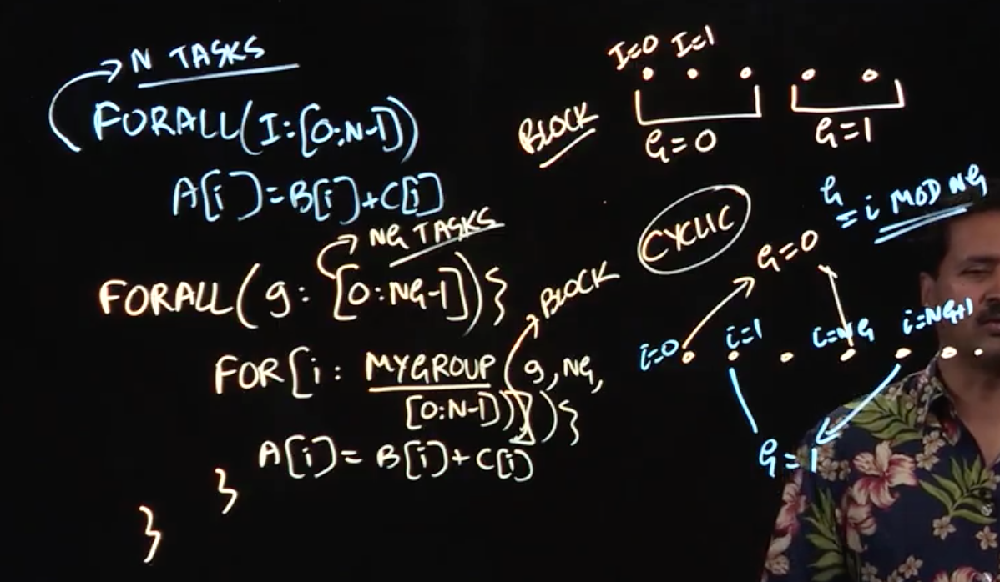

# 3.4  - Iteration Grouping/Chunking in Parallel Loops



To end this lecture, we'll go back to our vector addition example and re-examine how many tasks we're creating.

Recall that the pseudocode looks like:

```
forall(i: [0: N-1])
  a[i] = b[i] + c[i]
```

The above algorithm, simple though it is, creates N tasks. This is actually pretty unnecessary, (say your computer only has 8 or 16 cores), and will in practice slow your algorithm down because of the overheads of creating tasks.

How do we fix this? Using something called iteration chunking (or grouping).

## Iteration Chunking

We first note that while all these iterations can run in parallel, they don't need to all run in parallel with each other. We can address this using nested for loops.

```
forall(g: [0: NG-1]) {
  for (i: MYGroup(g, NG, [0:N-1])) {
    a[i] = b[i] + c[i];
  }
}
```

What we've effectively done here is tune *down* our level of parallelism, so now we are only creating NG tasks. What the optimal level of NG is will depend on the program your running as well as the specifics of your computer. It might be the number of cores on your computer, some multiple thereof, or indeed none of the above. Whatever it is, it is almost certainly going to be much, much smaller than N.

## Selecting Groups

All this talk of reducing the degree of parallelism and making sure each iteration of the loop targets a specific group naturally leads one to ask how we select each group.

The easiest way to select a group is called *block execution*, which is simply a matter of taking sequential groups of elements. The blocks could be equal in size (and working out the size is just a matter of simple arithmetic), or they could vary as appropriate.

There is the potential with block execution that we end up with uneven workloads (say, if the beginning of the iteration space involves more work than the end). For cases such as this, we also have the option of *cyclic execution*. This is similar to the way a dealer deals out cards to a group. More precisely, the first group would contain the elements with indices [0, NG, 2NG, 3NG] etc. More mathematically, the group of an element at index `i` can be determined using the formula `G = i % NG`

Taken together, this work gives us an elegant way of grouping together iterations.

## Lecture Notes

Lecture Summary: In this lecture, we revisited the vector addition example:

```
forall (i : [0:n-1]) a[i] = b[i] + c[i]
```

We observed that this approach creates n tasks, one per forall iteration, which is wasteful when (as is common in practice) n is much larger than the number of available processor cores.

To address this problem, we learned a common tactic used in practice that is referred to as loop chunking or iteration grouping, and focuses on reducing the number of tasks created to be closer to the number of processor cores, so as to reduce the overhead of parallel execution:

With iteration grouping/chunking, the parallel vector addition example above can be rewritten as follows:

```
forall (g:[0:ng-1])
  for (i : mygroup(g, ng, [0:n-1])) a[i] = b[i] + c[i]
```

Note that we have reduced the degree of parallelism from n to the number of groups, ng, which now equals the number of iterations/tasks in the forall construct.

There are two well known approaches for iteration grouping: block and cyclic. The former approach (block) maps consecutive iterations to the same group, whereas the latter approach (cyclic) maps iterations in the same congruence class (mod ng) to the same group. With these concepts, you should now have a better understanding of how to execute forall loops in practice with lower overhead.

For convenience, the PCDP library provides helper methods, forallChunked() and forall2dChunked(), that automatically create one-dimensional or two-dimensional parallel loops, and also perform a block-style iteration grouping/chunking on those parallel loops. An example of using the forall2dChunked() API for a two-dimensional parallel loop (as in the matrix multiply example) can be seen in the following Java code sketch:

```Java
forall2dChunked(0, N - 1, 0, N - 1, (i, j) -> {
   . . . // Statements for parallel iteration (i,j)
});
```