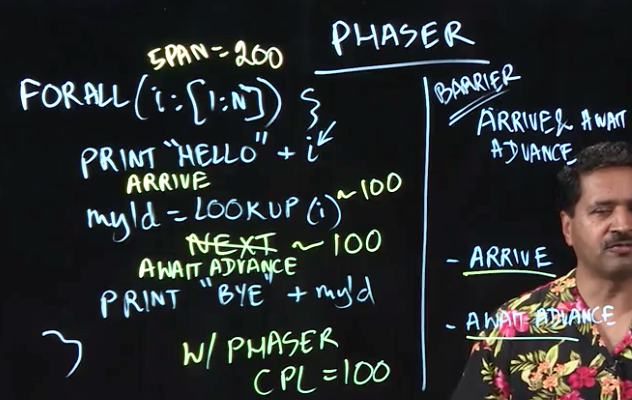

# Lecture 4 - Data Flow Synchronization and Pipelining



Having looked at barriers and parallel looping, we're now going to take a look at ways we can extend barriers in more advanced ways. In particular, we'll spend the next few lectures looking at the Java Phaser concept.

First, let's recall a small variation of the simple barrier example we had before, whose goal is to make sure all "Hello" statements occur before all "Bye" statements.

```
forall(i: [1:N]) {
  print "Hello" + i
  myId = LOOKUP(i) // Takes ~ 100 time units
  -- BARRIER (NEXT ~ 100 time units) --
  print "Bye" + myId
}
```

With this algorithm, regardless of how we order the statements in our loop, the critical path will always take about 200 time units.

However, a closer look at the algorithm indicates that, because the lookup is dependent only on i, and not on the previous print statement, it could in principle run in parallel with the barrier statement.

This is exactly where phasers come in.

## Phasers

Phasers are an object in Java with a method that implements a barrier called `arriveAndAwaitAdvance()`

The interesting thing about phasers is that you can split these constructs into two parts:
* `arrive()`
* `awaitAdvance()`

What's the utility of this? Well, we can re-write our example to be:

```
forall(i: [1:N]) {
  print "Hello" + i

  arrive();
  myId = LOOKUP(i) // Still takes ~100 time units
  awaitAdvance();

  print "Bye" + myId
}
```

What this is saying is that essentially, when the "Hello" statement of any iteration has actually completed, then we have `arrive`d at the phaser (which is a generalisation of a barrier). But it doesn't just need to sit there, there's some work it can do locally, namely the LOOKUP, before it has to pause to wait before advancing.

Thus, with phasers, the critical path of this function is reduced to 100 units, because the lookup process is done in parallel with the creation of the barrier.

## Lecture Notes

In this lecture, we examined a variant of the barrier example that we studied earlier:

```
forall (i : [0:n-1]) { 
  print HELLO, i;
  myId = lookup(i); // convert int to a string 
  print BYE, myId;
}
```

We learned about Java’s Phaser class, and that the operation `ph.arriveAndAwaitAdvance()`, can be used to implement a barrier through phaser object `ph`. We also observed that there are two possible positions for inserting a barrier between the two print statements above — before or after the call to `lookup(i)`. However, upon closer examination, we can see that the call to `lookup(i)` is local to iteration i and that there is no specific need to either complete it before the barrier or to complete it after the barrier. In fact, the call to `lookup(i)` can be performed in parallel with the barrier. To facilitate this split-phase barrier (also known as a fuzzy barrier) we use two separate APIs from Java Phaser class — `ph.arrive()` and `ph.awaitAdvance()`. Together these two APIs form a barrier, but we now have the freedom to insert a computation such as `lookup(i)` between the two calls as follows:

```
// initialize phaser ph	for use by n tasks ("parties") 
Phaser ph = new Phaser(n);
// Create forall loop with n iterations that operate on ph 
forall (i : [0:n-1]) {
  print HELLO, i;
  int phase = ph.arrive();
  
  myId = lookup(i); // convert int to a string

  ph.awaitAdvance(phase);
  print BYE, myId;
}
```

Doing so enables the barrier processing to occur in parallel with the call to `lookup(i)`, which was our desired outcome.