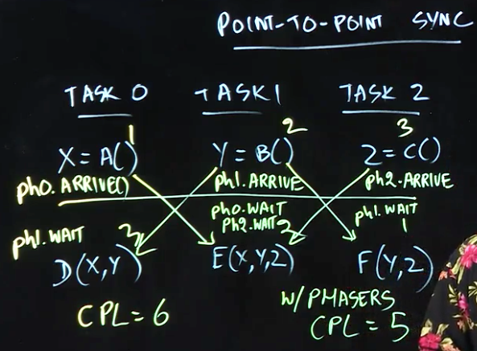
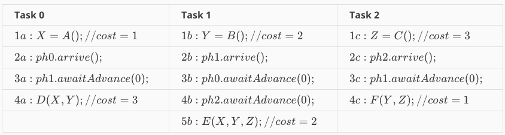

# Lecture 4.1 - Point-to-Point Synchronization with Phasers

In this note, we'll look at an application of phasers called point-to-point synchronization.

Say that you have 3 tasks. Each one calculates a seperate value independently, and then runs a function thats dependent on the numbers the other tasks calculated. So, for instance:

* Task 0 - Calculates `X = A()` then `D(X,Y)`
* Task 1 - Calculates `Y = B()` then `E(X,Y,Z)`
* Task 2 - Calculates `Z = C()` then `F(Y,Z)`

The question we have is "How do we ensure that there are no data races in this program?"

From what we've learnt so far, one solution would be to set up a barrier to ensure each task calculates its initial value (X, Y and Z) before any of them run their other functions. And that would work.

However, there's a more elegant way to do this. If we take a closer look, we note that function `D` doesn't actually need to wait for the completion of `Z`. Our current solution forces us to wait for all the values, regardless of which ones a specific function actually needs.

Phasers allow us to provide more fine grained controls on our barrier operations. To do this, we can create a phaser for each task, (0, 1, 2), and each one can then specify which other phasers it needs to wait for, as seen in the image above. This lets us reduce the critical path length by exposing more parallelism in the process.

## Lecture Notes

In this lecture, we looked at a parallel program example in which the span (critical path length) would be 6 units of time if we used a barrier, but is reduced to 5 units of time if we use individual phasers as shown in the following table:

Each column in the table represents execution of a separate task, and the calls to {\tt arrive()}arrive() and {\tt awaitAdvance(0)}awaitAdvance(0) represent synchronization across different tasks via phaser objects, {\tt ph0}ph0, {\tt ph1}ph1, and {\tt ph2}ph2, each of which is initialized with a party count of 1 (only one signalling task). (The parameter 0 in {\tt awaitAdvance(0)}awaitAdvance(0) represents a transition from phase 0 to phase 1.)