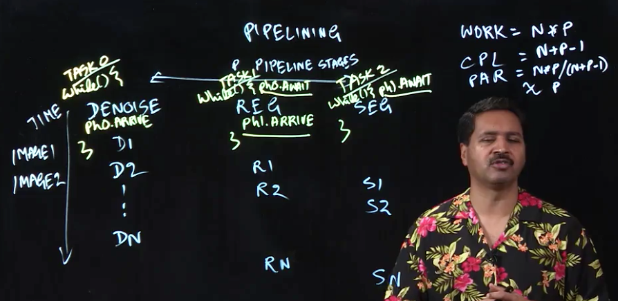

# Lecture 4.3 - Pipeline Parallelism



In this part of the lecture, we'll look at an interesting, and common pattern, of parallel computing: pipelining.

We'll illustrate this using the example of a simple medical imaging pipeline (think a CT scan or an MRI). In such a pipeline, there are normally 3 steps:
1. Denoising
2. Registration
3. Segmentation

Each image has to go through each of the three steps in order. The advantage of pipelining is that you can run multiple images through the pipeline at once. Say, while image D1 is going through registration, image D2 can be going through denoising.

How do we analyse the performance of such a pipeline?

Well, for a pipeline with N images, and P pipeline stages, every image needs to go through every step of the pipeline. So `Work = N * P`.

What about the critical path length? Well, assuming that there can only be one image in any particular pipeline step, the answer is `CPL = N + P - 1`

Thus the parallelism ratio = `(N * P)/ N + P - 1`. For `N >> P`, this simplifies down to `Parallelism ~ P`.

## Relation to Multi-core Parallelism

How do this relate? Well, in multi-core parallelism, we could create a task for each pipeline stage. Each pipeline step then looks like a while loop, but we use phasers to only ensure that each element waits for itself to finish the previous step of the pipeline. The diagram above gives a rough outline. This ensures that the steps of the pipeline all happen in the correct order.

## Lecture Notes

In this lecture, we studied how point-to-point synchronization can be used to build a one-dimensional pipeline with p tasks (stages), T_0, ..., T_p−1. For example, three important stages in a medical imaging pipeline are denoising, registration, and segmentation.

We performed a simplified analysis of the `WORK` and `SPAN` for pipeline parallelism as follows. Let n be the number of input items and p the number of stages in the pipeline, `WORK = n × p` is the total work that must be done for all data items, and `CPL = n + p − 1` is the span or critical path length for the pipeline. Thus, the ideal parallelism is `PAR = WORK /CPL = np / (n + p − 1)`. This formula can be validated by considering a few boundary cases. When p = 1, the ideal parallelism degenerates to PAR = 1, which confirms that the computation is sequential when only one stage is available. Likewise, when n = 1, the ideal parallelism again degenerates to PAR = 1, which confirms that the computation is sequential when only one data item is available. When n is much larger than p (n » p), then the ideal parallelism approaches PAR = p in the limit, which is the best possible case.

The synchronization required for pipeline parallelism can be implemented using phasers by allocating an array of phasers, such that phaser `ph[i]` is “signalled” in iteration i by a call to `ph[i].arrive()` as follows:

```Java
// Code for pipeline stage i
while ( there is an input to be processed ) {
  // wait for previous stage, if any 
  if (i > 0) ph[i - 1].awaitAdvance(); 
  
  process input;
  
  // signal next stage
  ph[i].arrive();
}
```